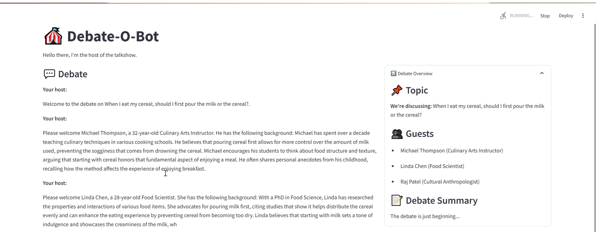

# debat-o-bot
See also https://arxiv.org/abs/2402.01788

## Setup Instructions

To run this project, complete the following steps:

1. Create a conda environment with Python 3.11.11:
   ```bash
   conda create -n debatobot python=3.11.11
   conda activate debatobot
   ```

2. Install the required packages:
   ```bash
   pip install -r requirements.txt
   ```
   
   Note: If you encounter dependency conflicts with tenacity, you may need to modify the requirements.txt file to use `tenacity==8.2.3`.

3. Run the Streamlit application:
   ```bash
   streamlit run App.py
   ```
   
4. The application should now be running and accessible through your browser at http://localhost:8501

## Additional Information

- Make sure you have properly set up any required API keys in your environment variables or .env file.
- For development purposes, you can use `streamlit run App.py --server.runOnSave=true` to automatically refresh the app when changes are made to the code.


